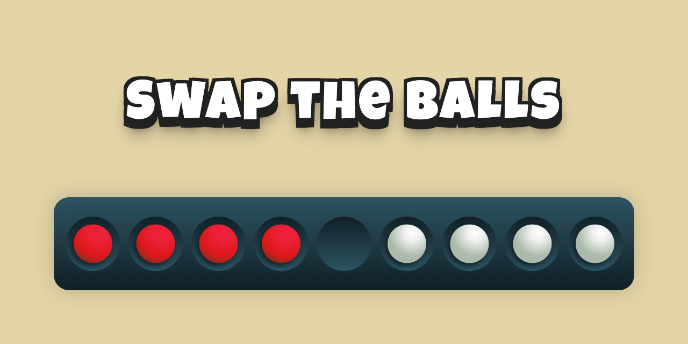

# Swap Game



I created this little game to play a little with [Svelte](https://svelte.dev). Now you can play with the balls!

Swap the colored balls in places. Each ball can only move in one direction, moving to an adjacent cell or through one.

## App Overview

1. The logic of the game does not depend on the framework. It is concentrated in the [game/game.ts](./src/game/game.ts) file in the form of pure functions.
   1. Each ball is represented by the value `1` or `-1` depending on its color.
   1. Since each ball can only move in one direction, it is enough for us to know the position of the ball for a move — we learn the rest from its color and neighboring balls.
   1. When the balls have reached the final position, it is a win. If there are no possible moves left, it's a loss.
   1. To better understand the logic of the game, take a look at the [tests](./src/game/game.test.ts).
1. For the convenience of players, moves can be undone. This is implemented in the [game/history.ts](./src/game/history.ts) file is also in the form of pure functions.
   1. Since the state of the game depends only on the moves made, it is enough to store the moves in the history.
   1. So, we store the made moves in a stack. And with undo, we reproduce the state by applying all the moves but the last one to the initial state.
   1. When we redo, we need to move forward in the stack.
   1. Check out the [tests](./src/game/history.test.ts) to figure it out.
1. [routes/+page.svelte](./src/routes/+page.svelte) renders the app. It also stores the state of the game and connects the state, UI components, and event handlers.
1. The [lib/Board.svelte](./src/lib/Board.svelte) component has an interesting trick for animating balls:
   1. As mentioned above, the game is made with pure functions, so that the state of the game is immutable.
   1. When the state changes, the components of the balls in the DOM disappear in one place and appear in another.
   1. At the same time, to animate the movement of the ball using [crossfade](https://svelte.dev/docs/svelte-transition#crossfade), we need to know where a particular ball has moved. In svelte, you can describe this information using the key `property`.
   1. According to the rules of the game, all balls of the same color can only move in one direction and cannot jump over balls of their own color. So the balls of the same color always go in the same order.
   1. Using this, we mark all balls of the same color with numbers from `1` to `4`, and all balls of the other color with numbers from `-4` to `-1`.
   1. Thus, when moving one ball, we know where it moved from, and svelte can animate it.

## Developing

Start a development server:

```bash
npm run dev

# or start the server and open the app in a new browser tab
npm run dev -- --open
```

## Building

To create a production version:

```bash
npm run build
```

You can preview the production build with `npm run preview`.
